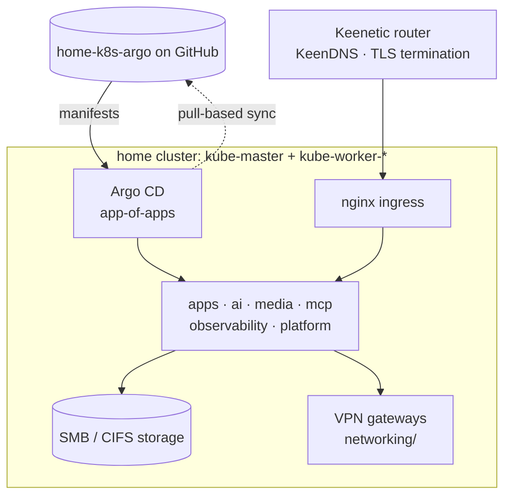

# home-k8s-argo

A GitOps-managed home Kubernetes cluster (`kube-master` + `kube-worker-*`),
described end-to-end as Argo CD `Application` manifests. Argo CD reconciles
everything here straight from git — self-hosted apps, media, observability,
Model Context Protocol servers, storage and networking — with **no credentials
in the repo** (everything sensitive is injected out-of-band) and **data-safe
enable/disable** of any service through pure GitOps.

> Background: this is **stage 1** of a split from
> [`home-k8s-helm`](https://github.com/Arbuzov/home-k8s-helm) — the
> `Application` resources moved here; the local Helm charts (Grafana, MinIO,
> MySQL, wg-vless-gateway, wstunnel, …) still live in the original repo.

## Highlights

A few of the more interesting engineering write-ups here — each lives in its
service's own README:

- **InfluxDB OOM-loop fix** — a 1849-restart crash loop on an 8 GB Pi-class
  node, traced to the in-memory series index and fixed with on-disk `tsi1` +
  deferred full compaction ([`observability/influxdb/`](observability/influxdb/README.md)).
- **GitLab MCP behind a corporate VPN** — a `token-injector` sidecar that keeps
  the PAT out of git, stateless OAuth sessions that survive pod restarts, and a
  single shared VPN gateway (one session for all clients)
  ([`mcp/gitlab/`](mcp/gitlab/README.md), [`networking/openconnect-gateway/`](networking/openconnect-gateway/README.md)).
- **SQLite on SMB without corruption** — running Vikunja's SQLite over a CIFS
  share via `nobrl`, uid/gid mount semantics, and single-replica discipline
  ([`apps/vikunja/`](apps/vikunja/README.md)).
- **Declarative secret hygiene** — two wiring styles that keep every password,
  token and OIDC secret out of both git *and* rendered ConfigMaps
  ([Secrets handling](#secrets-handling)).

## Architecture



Two delivery models run side by side — **pull-based** app-of-apps groups that
Argo CD watches on GitHub, and **push-based** groups applied with `kubectl`
(see [How services are deployed](#how-services-are-deployed)).

## Layout

Top-level directories group services by role:

```
ai/             # AI / automation (n8n)
apps/           # User-facing apps (heimdall, homepage, octoprint, openclaw)
mcp/            # Model Context Protocol servers (atlassian, basic-memory, graphiti, kubernetes, mcpo)
media/          # Media (jellyfin, opds-shelf, photoprism, pigallery2)
networking/     # VPN / tunnels (openconnect-gateway, wg-vless-gateway, wstunnel)
observability/  # Metrics / logs (influxdb, keenetic-grafana-monitoring, prometheus)
platform/       # Cluster plumbing (argo-cd, arc-operator, kubernetes-dashboard, metrics-server)
storage/        # Storage backends (smb)
```

Each service is a directory with:

- `application.yaml` — the Argo CD `Application` resource
- `application-<variant>.yaml` — when one chart is reused for multiple
  Applications (currently only `mcp/atlassian/` for Jira + Confluence)
- `README.md` — present when the service needs out-of-band Secrets that
  you must `kubectl create` before the first sync, or when a manifest
  value needs rationale that (by convention) must not live in a YAML
  comment (see [`CLAUDE.md`](CLAUDE.md))

## How services are deployed

Two delivery models live side by side:

### App-of-apps groups — pull-based GitOps

`apps/`, `media/`, `mcp/`, `platform/` and `storage/` each ship a
`bootstrap.yaml` app-of-apps that points Argo CD at this repo on GitHub over
HTTPS and reconciles that group's `AppProject` (`<group>/project.yaml`, where
the group has one — `media/` and `storage/` have none, so their children stay
in `default`) plus every enabled child `Application` automatically. Bootstrap
each once, after the repo is pushed to GitHub:

```sh
kubectl apply -f apps/bootstrap.yaml
kubectl apply -f media/bootstrap.yaml
kubectl apply -f mcp/bootstrap.yaml
kubectl apply -f platform/bootstrap.yaml
kubectl apply -f storage/bootstrap.yaml
```

From then on Argo CD watches `main`: edit a `<group>/<service>/application.yaml`,
commit and push, and it syncs on its own (each app-of-apps runs `automated`
sync with `prune` + `selfHeal`). The children belong to their group's
AppProject (`project: apps` / `mcp` / `platform`); the app-of-apps itself stays
in `default` so it can create that project. `media/` is the exception — it has
no AppProject, so its children and its app-of-apps both stay in `default`. Each
group's `README.md` documents which children are enabled vs. held back via the
`bootstrap.yaml` `exclude` glob (`platform/` currently deploys only `argo-cd` +
`arc-operator`; `media/` holds back `opds-shelf`).

### Everything else — push-based

The remaining groups, and any app-of-apps child held back by an `exclude`
glob, are **not** watched by Argo CD. To deliver a change, apply the
Application directly:

```sh
kubectl apply -f <group>/<service>/application.yaml
```

Argo CD then reconciles the inline `helm.values` against the upstream chart
it references.

Two services pull their chart from the separate `home-k8s-helm` repo (where
the local Helm charts live) rather than an upstream registry:

- `networking/wg-vless-gateway` — chart at `Arbuzov/home-k8s-helm`,
  path `arbuzov/networking/wg-vless-gateway`
- `networking/wstunnel` — chart at `Arbuzov/home-k8s-helm`,
  path `arbuzov/networking/wstunnel`

For those two, a chart edit requires pushing `home-k8s-helm` before
Argo CD picks it up.

## Secrets handling

No credentials are committed to this repo. Everything sensitive
(database passwords, API tokens, OIDC client secrets, …) lives **only**
in Kubernetes `Secret` resources that you create **out-of-band** before
the first sync. Moving to a new cluster means recreating those Secrets
by hand — an accepted trade-off for a home-lab. Each service's
`README.md` has the exact `kubectl create secret` command.

Two wiring styles, both fully declarative from git:

1. **Native Secret reference.** Where a chart can read the value from a
   Secret (`envFrom.secretRef`, `secretKeyRef`, ingress `auth-secret`
   annotations, …) the manifest references it by name; the value never
   appears anywhere but the Secret.

2. **Runtime injection for ConfigMap-rendering charts.** A few charts
   render their config into a `ConfigMap`, which can't hold a Secret
   reference. For those we keep the secret out of **both** git and the
   ConfigMap by injecting it through the app's own env-var mechanism,
   leaving only a harmless placeholder in the committed config:

   | Service         | Secret (namespace)            | Mechanism                                                                      |
   | --------------- | ----------------------------- | ----------------------------------------------------------------------------- |
   | `apps/homepage` | `homepage-secrets` (homepage) | `{{HOMEPAGE_VAR_*}}` in config, resolved at runtime from env                   |
   | `apps/vikunja`  | `vikunja-oidc` (vikunja)      | `VIKUNJA_AUTH_OPENID_PROVIDERS_GOOGLE_CLIENT{ID,SECRET}` env                   |
   | `storage/smb`   | `smbcreds` (smb)              | `${SAMBA_USER}/${SAMBA_PASSWORD}` interpolated by the image at runtime         |
   | `mcp/mcpo`      | `mcpo-secrets` (mcp)          | whole `config.json` from the Secret via chart `existingConfigSecret` (≥ 0.2.7) |

   The committed manifests carry only those placeholders / env
   references, never the real value. (The old `application.local.yaml`
   mechanism is gone; `.gitignore` still excludes `*.local.yaml` as a
   safety net.)

### Secrets each service expects

Create these before applying the corresponding Application (each
service's `README.md` has the concrete command):

| Service                 | Secret(s) (namespace)                                                             |
| ----------------------- | -------------------------------------------------------------------------------- |
| `platform/argo-cd`      | `argocd-secret` (admin bcrypt, Google OIDC client ID/secret), `argocd-redis`     |
| `platform/arc-operator` | `controller-manager` (GitHub PAT)                                                |
| `ai/n8n`                | `n8n-secrets` (encryption key), `postgres-n8n` (DB creds)                        |
| `apps/heimdall`         | `heimdall-postgres` (DB creds)                                                   |
| `apps/homepage`         | `homepage-secrets` (Argo CD homepage token, Home Assistant LLAT), `homepage-bookmarks` (work-bookmark URLs `HOMEPAGE_VAR_WORK_*`) |
| `apps/openclaw`         | `openclaw-env-secret`                                                            |
| `apps/vikunja`          | `vikunja-oidc` (Google OIDC client ID/secret — shared with Argo CD)              |
| `mcp/atlassian`         | `mcp-corp-config` (Jira/Confluence/GitLab URLs + VPN subnet, shared), `mcp-atlassian-{jira,confluence}-credentials`, `mcp-atlassian-vpn-credentials` |
| `mcp/gitlab`            | `mcp-gitlab-credentials` (PAT), `mcp-gitlab-stateless`, `mcp-corp-config` (shared); held back — applied push-based from a gitignored overlay (see `mcp/gitlab/README.md`) |
| `mcp/graphiti`          | `graphiti-neo4j-auth`, `graphiti-mcp-secrets` (Neo4j + OpenAI)                   |
| `mcp/mcpo`              | `mcpo-secrets` (`config.json` incl. Home Assistant LLAT)                         |
| `media/photoprism`      | `photoprism-basic-auth` (htpasswd)                                               |
| `media/opds-shelf`      | `opds-shelf-basic-auth` (htpasswd for `/opds`) — Google login is Calibre-Web native OAuth in `app.db`, not a Secret |
| `observability/keenetic-grafana-monitoring` | `keenetic-grafana-monitoring-config` (influxdb) — `config.ini` (router pw + InfluxDB token) |

The remaining services have no secrets in their manifests.

Cluster-wide shared Secrets that several Applications expect to find:

- `smbcreds` in namespace `smb` — one set of samba credentials used by
  the `smb.csi.k8s.io` StorageClasses, by every workload that mounts an
  SMB share, **and** by the samba server itself (`storage/smb` reads it
  via env)
- `mcp-basic-auth` in namespace `mcp` — htpasswd for the `/mcp/*`
  ingress basic-auth annotations

## Bootstrap order

When standing up a fresh cluster:

1. Install Argo CD with `helm` directly (the bootstrap values are still
   in `home-k8s-helm/arbuzov/platform/argo-cd/values.yaml`).
2. Create `argocd-secret` in the `argo-cd` namespace
   (see `platform/argo-cd/README.md`).
3. `kubectl apply -f platform/bootstrap.yaml` to bring up the `platform`
   app-of-apps, which hands ownership of the Argo CD install over to Argo CD
   (the self-managing `argo-cd` child) and deploys `arc-operator`. Create
   `arc-operator`'s `controller-manager` Secret first (see
   `platform/arc-operator/README.md`).
4. Bring up storage next — most other workloads mount `storage/smb`'s shares.
   Create its `smbcreds` Secret (see `storage/smb/README.md`), then
   `kubectl apply -f storage/bootstrap.yaml` to bring up the `storage`
   app-of-apps, which syncs `smb` on its own.
5. Then `platform/metrics-server`, `platform/kubernetes-dashboard` — still
   push-based for now (held back by the `platform` app-of-apps `exclude`
   glob), so apply each directly.
6. Apply the rest as needed; create each app's Secrets (per its
   `README.md`) before applying its Application.

## What's intentionally **not** here

- Local Helm charts (`observability/grafana`, `storage/{minio,mysql}`,
  `observability/keenetic-grafana-monitoring`'s wrapper chart,
  `networking/wg-vless-gateway`, `networking/wstunnel`) — they stay in
  `home-k8s-helm`. Two of those (wg-vless-gateway, wstunnel) are
  consumed by Applications **here**.
- Cluster bootstrap (`home-k8s-ansible`).
- One-off scripts (`home-k8s-helm/tools/`).
